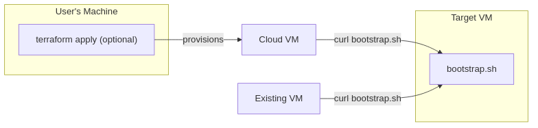
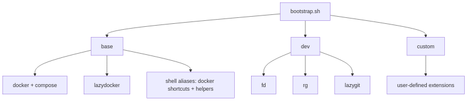
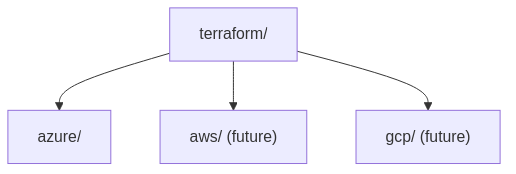

# spinup

## Overview



## Bootstrap Tiers



## Terraform Templates

Terraform templates for provisioning VMs — just `.tf` files you clone and run. Built on official providers:

- **Azure** — [Azure/terraform quickstarts](https://github.com/azure/terraform/tree/master/quickstart) · [Linux VM quickstart](https://learn.microsoft.com/en-us/azure/virtual-machines/linux/quick-create-terraform)
- **AWS** — [aws-samples/aws-terraform-template](https://github.com/aws-samples/aws-terraform-template) · [terraform-aws-ec2-instance](https://github.com/terraform-aws-modules/terraform-aws-ec2-instance)



## Quick Start

```bash
# Run directly
curl -sSL https://github.com/NicholasGoh/spinup/releases/latest/download/bootstrap.sh | bash

# Or verify first
curl -sSLO https://github.com/NicholasGoh/spinup/releases/latest/download/bootstrap.sh
curl -sSLO https://github.com/NicholasGoh/spinup/releases/latest/download/bootstrap.sh.sha256
sha256sum -c bootstrap.sh.sha256 && bash bootstrap.sh

# Dev tier (base + fd, ripgrep, lazygit)
curl -sSL https://github.com/NicholasGoh/spinup/releases/latest/download/bootstrap.sh | bash -s -- --dev
```
